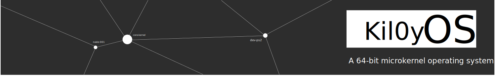
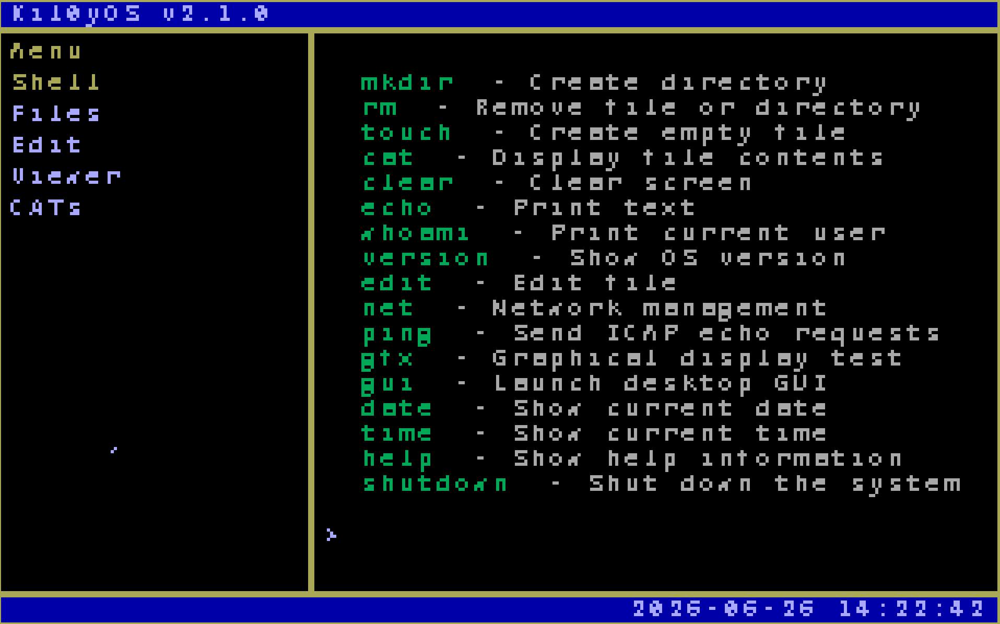
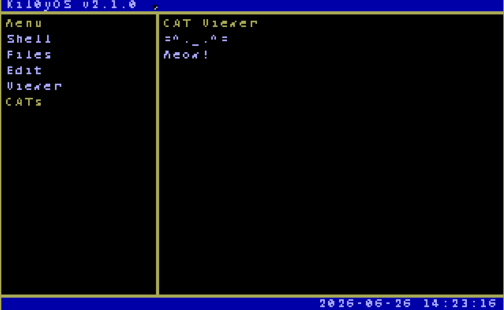

<div align="center">
  
  <h1>kil0yOS</h1>
  <p><strong>A 64-bit x86-64 microkernel operating system</strong></p>
</div>

## Features

- **x86-64 long mode** with 4-level page tables and identity-mapped first 4 GiB
- **Physical Memory Manager (PMM)** — bitmap-based 4 KiB page frame allocator with Multiboot2 mmap parsing
- **Virtual Memory Manager (VMM)** — on-demand 4-level page table mapping, unmapping, and address translation
- **Kernel panic & assert** (`PANIC`, `ASSERT`) with serial + VGA output and CPU halt
- Memory management with heap allocation
- VGA text mode display
- **TempleOS-style tiling GUI desktop** (320x200 VGA mode 13h)
- **Interactive graphical shell** with keyboard-driven menu navigation
- PS/2 keyboard and mouse input handling
- 64-bit interrupt handling with PIC, ISRs, and IDT
- GDT and IDT setup with proper long-mode descriptors
- FAT32-like filesystem with directories and files
- Persistent filesystem with ACPI shutdown support
- Command-line shell with built-in commands
- File read/write/edit operations
- Round-robin task scheduler with 64-bit context switching
- Network stack with Intel E1000 and RTL8139 driver support

## Prerequisites

- gcc (x86-64 cross-compilation support)
- nasm
- ld (GNU linker)
- grub-mkrescue
- qemu-system-x86_64

> **Note:** This is a 64-bit kernel. Ensure your toolchain supports `-m64` and your emulator/VM is configured for a 64-bit guest.

## Build

```bash
make
```

## Run

```bash
make run
```

## Commands

- ls - List directory contents
- cd - Change directory
- pwd - Print working directory
- mkdir - Create directory (supports path like `mkdir subdir/file`)
- rm - Remove file or directory
- touch - Create empty file
- cat - Display file contents
- edit - Edit file contents
- clear - Clear screen
- echo - Print text (supports redirect to file with >)
- whoami - Print current user
- version - Show OS version
- help - Show help information
- shutdown - Shut down the system (ACPI S5)
- net - Network management (wire, chknic, status)
- ping - Send ICMP echo requests

## GUI Desktop

Run the `gui` command to enter the graphical tiling desktop. Navigate the left menu with **arrow keys** and press **Enter** to switch panels.

### Interactive Shell

The **Shell** panel provides a fully interactive graphical shell supporting `ls`, `cd`, `mkdir`, `touch`, `pwd`, `shutdown`, and more.



### CAT Viewer

Because every OS needs a cat.



## Project Structure

```
src/
  boot/               - Bootloader (Multiboot2 + long mode entry, Assembly)
  kernel/
    core/             - Kernel core (main.c, gdt.c, idt.c, isr.c, interrupts.c)
    drivers/          - Device drivers
      disk.c          - ATA disk driver
      keyboard.c      - PS/2 keyboard driver
      mouse.c         - PS/2 mouse driver
      pci.c           - PCI bus enumeration
      pit.c           - Programmable Interval Timer
      power.c         - ACPI power management
      rtc.c           - Real-time clock
      vga.c           - VGA display driver
    fs/               - Filesystem
      fs.c            - FAT32-like filesystem
      edit.c          - Text editor
    lib/              - Standard library (string.c, stdlib.c)
    mm/               - Memory management (memory.c)
    net/              - Network stack
      net.c           - Core network stack
      e1000.c         - Intel E1000 NIC driver
      rtl8139.c       - Realtek RTL8139 NIC driver
      dhcp.c          - DHCP client
      udp.c           - UDP protocol
    sched/            - Task scheduler
    shell/            - Command-line shell
    timer/            - Timer management

include/              - Header files
Makefile              - Build configuration
grub.cfg              - GRUB2 boot configuration
linker.ld             - 64-bit linker script
grub.cfg              - GRUB configuration
```

## License

GPL2.0
