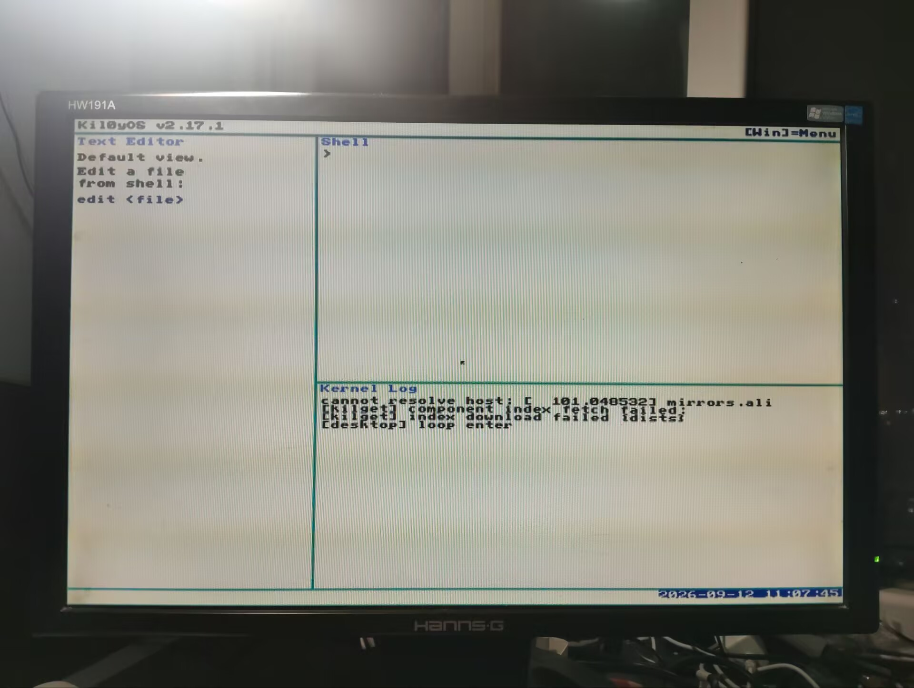

<div align="center">
  
  <h1>kil0yOS</h1>
  <p><strong>A 64-bit x86-64 operating system</strong></p>

  <p>
    <a href="#">
      
    </a>
    <a href="https://github.com/Miwafi/Kil0yOS/issues">
      
    </a>
    <a href="https://github.com/Miwafi/Kil0yOS">
      
    </a>
  </p>

  <p>
    <a href="README.md"><strong>English</strong></a> |
    <a href="README.zh.md"><strong>简体中文</strong></a>
  </p>
</div>

## What is this

A hobby operating system for x86-64, written from scratch in C and assembly. GRUB2 boots it on BIOS and UEFI firmware, in QEMU or a real VM like VMware. It has its own kernel, drivers, network stack, filesystems, a small GUI, and a Linux compatibility layer that runs real Linux ELF binaries.

## Features

Kernel:

- x86-64 long mode, 4-level paging (5-level detected automatically), per-process address spaces
- Bitmap PMM, on-demand VMM, heap with canary checks
- Round-robin scheduler, ring 3 user programs with their own syscalls
- PS/2 keyboard and mouse, PIT/RTC, ACPI power-off
- VGA text console on BIOS, GOP framebuffer console (1024x768x32) on UEFI

Linux compatibility:

- Runs real Linux x86-64 ELF binaries: static, dynamic PIE, and `PT_INTERP` interpreter loading
- busybox 1.36.1 (musl static, ~390 applets), musl dynamic PIE, and glibc dynamic PIE all work
- ~60 Linux syscalls: `openat`, `statx`, `getdents64`, `mmap`, `brk`, `readv`/`writev`, `poll`, the socket family, ...
- `fork`/`vfork`/`clone`/`wait4`/`execve` with a TTY line discipline
- ext2 read-only root + FAT32 RAM disk + write overlay, so `/bin` survives reboots
- `dpkg` and `kilget` install real Debian packages; Ubuntu's `libc6` installs and runs

Network:

- E1000 and RTL8139 NIC drivers
- Ethernet, ARP, IPv4, ICMP, UDP, TCP (sliding window, retransmission, flow control)
- DHCP, TFTP, DNS, HTTP/1.1 (busybox `wget` works)

GUI:

- TempleOS-style tiling desktop: VGA mode 12h (640x480x16, planar) on BIOS, GOP framebuffer on UEFI
- A Pong game running as a ring 3 program through the graphics syscalls

## Build and run

You need gcc, nasm, ld, grub-mkrescue, and qemu-system-x86_64. The Linux-ABI test programs (busybox, musl/glibc builds) are built on a WSL/Debian host; see `tools/`.

```bash
make        # produces build/kil0yos.iso
make run    # headless boot, serial console on stdio
qemu-system-x86_64 -cdrom build/kil0yos.iso -m 512M   # with a window
```

The ISO also boots in VMware/VirtualBox; enable EFI firmware for the UEFI path.

## Shell

Basic file and system commands: `ls`, `cd`, `pwd`, `mkdir`, `rm`, `touch`, `cat`, `edit`, `clear`, `echo` (`>` redirect), `whoami`, `date`, `time`, `version`, `help`, `shutdown` (ACPI S5).

The interesting ones:

- `net`, `ping` — network info (`net ifconfig`, `net netstat`) and ICMP echo
- `tftp` — pull a file over TFTP and install it to `/bin`
- `dpkg` — `dpkg -i file.deb`, `-r pkg`, `-l`, `-L pkg`
- `kilget` — repo client, apt-get equivalent: `update`, `install`, `show`, `list`, `installed` (`apt-get` is an alias)
- `exec` — run a user program, e.g. `exec /bin/pong.bin`

Unknown commands fall through to busybox (`/bin/busybox <cmd>`), so `find`, `grep`, `wget`, `nslookup`, `vi`, `ps`, ... all work.

Packaging, end to end:

```text
$ echo deb http://10.0.2.2:8000 . > /etc/kilget/sources.list
$ kilget update
$ kilget install libc6
kilget: downloading libc6_2.35-0ubuntu3_amd64.deb ...
 [kilget] installed libc6
$ exec /usr/lib/x86_64-linux-gnu/ld-linux-x86-64.so.2
...usage banner from the real glibc dynamic linker...
```

## GUI

Run `gui` (or `desktop` if you're launching system from UEFI) to enter the tiling desktop. On BIOS boots it drives the VGA in mode 12h at 640x480, 16 colors; on UEFI it renders onto the GOP framebuffer. Arrow keys navigate the left menu, Enter switches panels.

### Cat

Because every OS needs one.


### System panel


### Pong

`exec /bin/pong.bin` plays against the AI, first to 5 wins. W/S to move, ESC returns to the shell. Rendered through ring 3 graphics syscalls with incremental, flicker-free updates.

### Real hardware

The VGA desktop also runs on bare metal — write the USB image with `make usb` and boot a BIOS machine from the stick.



## Project structure

```
src/boot/             Boot entry (Multiboot2, long mode, UEFI, assembly)
src/kernel/core/      Kernel core: processes, ELF loader, Linux syscall table, VFS shim, TTY
src/kernel/drivers/   Device drivers (keyboard, mouse, disk, PCI, VGA, power, ...)
src/kernel/fs/        Multi-backend VFS: FAT RAM disk + ext2 root + write overlay
src/kernel/mm/        PMM / VMM / heap
src/kernel/net/       TCP/IP stack, DHCP, TFTP, DNS, HTTP, E1000 + RTL8139 drivers
src/kernel/pkg/       Debian packages: dpkg, kilget, ar/tar/gzip/sha256
src/kernel/sched/     Scheduler
src/kernel/shell/     Shell and terminal
src/kernel/timer/     PIT
src/kernel/usb/       UHCI host controller + USB HID
user/                 Linux-ABI test programs
tools/                Build and acceptance tooling (busybox build, QEMU headless harnesses)
CHANGELOG.md          Release notes
ROADMAP_LINUX_COMPAT.md   Linux compatibility roadmap (phases 0-4)
```

## License

GPL-2.0
