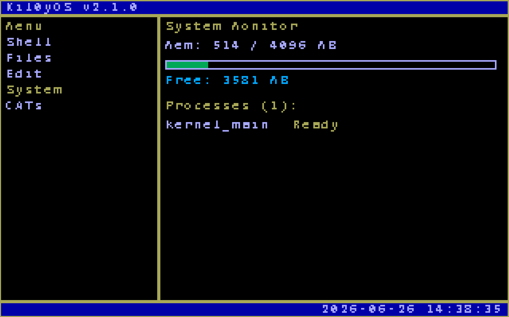

<div align="center">
  
  <h1>kil0yOS</h1>
  <p><strong>一个 64 位 x86-64 微内核操作系统</strong></p>

  <p>
    <a href="#">
      
    </a>
    <a href="https://github.com/Miwafi/Kil0yOS/issues">
      
    </a>
    <a href="https://github.com/Miwafi/Kil0yOS">
      
    </a>
  </p>

  <p>
    <a href="README.md"><strong>English</strong></a> |
    <a href="README.zh.md"><strong>简体中文</strong></a>
  </p>
</div>

## 功能特性

- **x86-64 长模式**，4 级页表，前 4 GiB 恒等映射
- **物理内存管理器 (PMM)** — 基于位图的 4 KiB 页框分配器，支持 Multiboot2 内存映射解析
- **虚拟内存管理器 (VMM)** — 按需 4 级页表映射、取消映射和地址转换
- **内核恐慌与断言**（`PANIC`、`ASSERT`），支持串口 + VGA 输出并停机
- 堆内存管理
- VGA 文本模式显示
- **TempleOS 风格平铺 GUI 桌面**（320x200 VGA 模式 13h）
- **交互式图形 Shell**，键盘驱动的菜单导航
- PS/2 键盘和鼠标输入处理
- 64 位中断处理，支持 PIC、ISR 和 IDT
- GDT 和 IDT 设置，完整长模式描述符
- FAT32 类文件系统，支持目录和文件
- 持久化文件系统，支持 ACPI 关机
- 命令行 Shell，内置常用命令
- 文件读/写/编辑操作
- 时间片轮转任务调度器，支持 64 位上下文切换
- 网络协议栈，支持 Intel E1000 和 RTL8139 驱动

## 前置要求

- gcc（支持 x86-64 交叉编译）
- nasm
- ld（GNU 链接器）
- grub-mkrescue
- qemu-system-x86_64

> **注意：** 这是一个 64 位内核。请确保你的工具链支持 `-m64`，且模拟器/虚拟机已配置为 64 位客户机。

## 构建

```bash
make
```

## 运行

```bash
make run
```

## 命令

- ls - 列出目录内容
- cd - 切换目录
- pwd - 显示当前工作目录
- mkdir - 创建目录（支持路径，如 `mkdir subdir/file`）
- rm - 删除文件或目录
- touch - 创建空文件
- cat - 显示文件内容
- edit - 编辑文件内容
- clear - 清屏
- echo - 打印文本（支持用 > 重定向到文件）
- whoami - 显示当前用户
- version - 显示操作系统版本
- help - 显示帮助信息
- shutdown - 关机（ACPI S5）
- net - 网络管理（wire, chknic, status）
- ping - 发送 ICMP 回显请求

## GUI 桌面

运行 `gui` 命令进入图形化平铺桌面。使用 **方向键** 导航左侧菜单，按 **Enter** 切换面板。

### 交互式 Shell

**Shell** 面板提供一个完全交互式的图形化 Shell，支持 `ls`、`cd`、`mkdir`、`touch`、`pwd`、`shutdown` 等命令。


### CAT 查看器

每个操作系统都需要一只猫。


### 系统面板

想查看系统状态吗？



## 项目结构

```
src/
  boot/               - 引导程序（Multiboot2 + 长模式入口，汇编）
  kernel/
    core/             - 内核核心（main.c, gdt.c, idt.c, isr.c, interrupts.c）
    drivers/          - 设备驱动
      disk.c          - ATA 磁盘驱动
      keyboard.c      - PS/2 键盘驱动
      mouse.c         - PS/2 鼠标驱动
      pci.c           - PCI 总线枚举
      pit.c           - 可编程间隔定时器
      power.c         - ACPI 电源管理
      rtc.c           - 实时时钟
      vga.c           - VGA 显示驱动
    fs/               - 文件系统
      fs.c            - FAT32 类文件系统
      edit.c          - 文本编辑器
    lib/              - 标准库（string.c, stdlib.c）
    mm/               - 内存管理（memory.c）
    net/              - 网络协议栈
      net.c           - 网络协议栈核心
      e1000.c         - Intel E1000 网卡驱动
      rtl8139.c       - Realtek RTL8139 网卡驱动
      dhcp.c          - DHCP 客户端
      udp.c           - UDP 协议
    sched/            - 任务调度器
    shell/            - 命令行 Shell
    timer/            - 定时器管理

include/              - 头文件
Makefile              - 构建配置
grub.cfg              - GRUB2 引导配置
linker.ld             - 64 位链接脚本
```

## 许可证

GPL2.0
