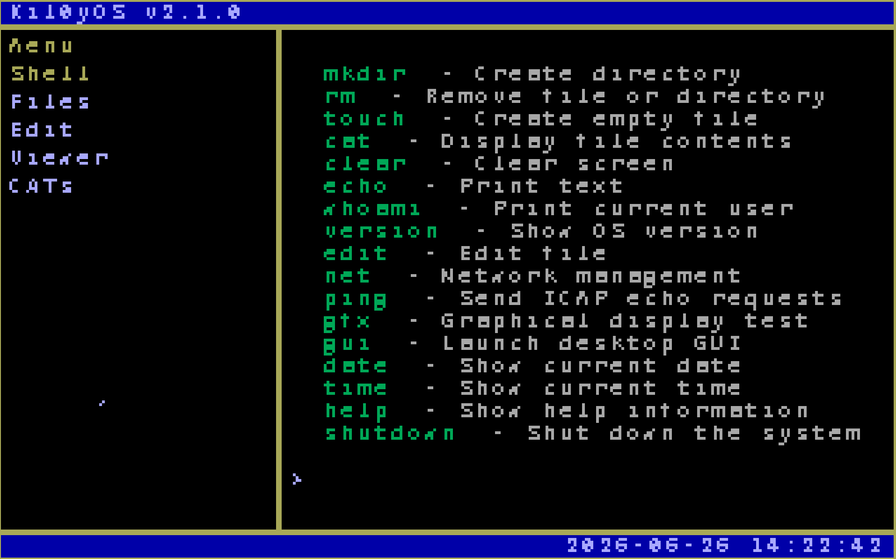
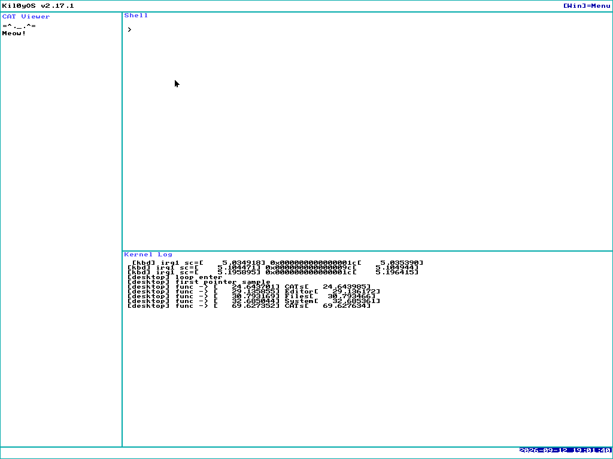
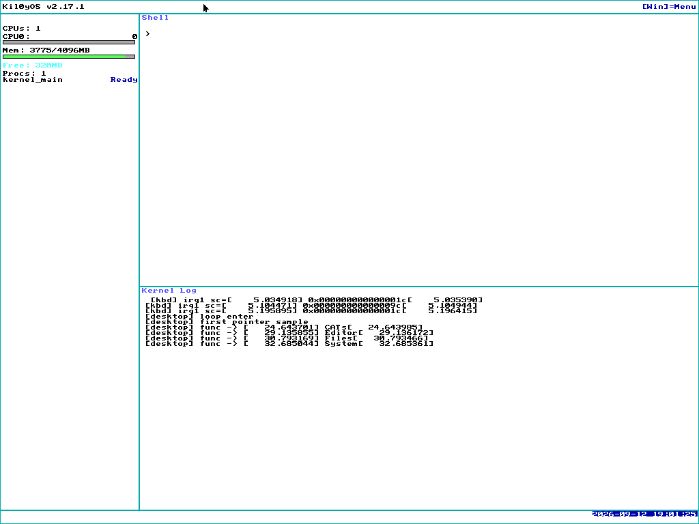

<div align="center">
  
  <h1>kil0yOS</h1>
  <p><strong>一个带 Linux 兼容层的 64 位 x86-64 微内核操作系统</strong></p>

  <p>
    <a href="#">
      
    </a>
    <a href="https://github.com/Miwafi/Kil0yOS/issues">
      
    </a>
    <a href="https://github.com/Miwafi/Kil0yOS">
      
    </a>
  </p>

  <p>
    <a href="README.md"><strong>English</strong></a> |
    <a href="README.zh.md"><strong>简体中文</strong></a>
  </p>
</div>

## 功能特性

### 内核核心
- **x86-64 长模式**，4 级页表，前 4 GiB 恒等映射
- **物理内存管理器 (PMM)** — 基于位图的 4 KiB 页框分配器，支持 Multiboot2 内存映射解析
- **虚拟内存管理器 (VMM)** — 按需 4 级页表映射、取消映射和地址转换，支持**每进程独立地址空间**（私有 CR3 根，fork/exec 生命周期）
- **内核恐慌与断言**（`PANIC`、`ASSERT`），支持串口 + VGA 输出并停机
- 堆内存管理，带完整性哨兵与空闲链校验
- 64 位中断处理，支持 PIC、ISR 和 IDT；GDT 使用完整长模式描述符
- 时间片轮转任务调度器，支持 64 位上下文切换
- VGA 文本模式显示与 **TempleOS 风格平铺 GUI 桌面**（320x200 模式 13h）
- PS/2 键盘和鼠标输入处理

### Linux 兼容层（Linux-ABI）
- **可运行真实的 Linux x86-64 ELF 程序** — 静态、动态 PIE 及完整 ELF 解释器加载（`PT_INTERP`）：busybox 1.36.1（musl 静态，约 390 个 applet）、musl 动态 PIE、glibc 动态 PIE 程序均可运行
- **进程模型**：`fork`/`vfork`/`clone`、`wait4`、`execve`，每进程独立地址空间；TTY 行规程（规范模式输入）
- **Linux 系统调用层**（`syscall_lnx`）：约 60 个系统调用，含 `openat`、`statx`、`getdents64`、`mmap`（fd 映射）、`brk`、`readv`/`writev`、`poll`、`futex`/`rseq` 桩、`arch_prctl(SET_FS)` 及 socket 系列
- **Linux VFS 垫片**（`lnxvfs`）：fd 表、stat/dirent 转换，桥接内部文件系统
- **统一多后端 VFS**：持久化 ext2 只读根（`/`）、FAT32 内存盘、内存写覆盖层 — `/bin` 重启后仍在
- **Debian 软件包生态**：`dpkg` 前端（status 数据库、`-i/-l/-L/-r`、依赖检查与事务模式）与 `kilget` 仓库客户端（`sources.list`、RFC822 `Packages` 索引、SHA256 校验、拓扑依赖序安装）— 真实 Ubuntu `libc6` 可安装并运行（通过执行安装后的 `ld-linux-x86-64.so.2` 验证）

### 网络协议栈
- Intel E1000 与 Realtek RTL8139 网卡驱动（PCI Vendor/Device ID 匹配）
- Ethernet / ARP / IPv4 / ICMP / UDP / **TCP**，TCP 具备滑动窗口流控、重传定时器与 64 KiB 接收环
- DHCP 自适应配置，静态地址回退
- **TFTP 客户端**（RFC 1350）、**UDP DNS** 解析（`nslookup`）、**HTTP/1.1 客户端**（busybox `wget` 可用）

### 用户程序
- **Ring 3 用户程序**，从 `/bin` 加载，提供图形 + 键盘系统调用接口
- 内置 **乒乓球游戏**（`exec /bin/pong.bin`），AI 对手，增量渲染无闪烁

## 前置要求

- gcc（支持 x86-64 交叉编译）
- nasm
- ld（GNU 链接器）
- grub-mkrescue
- qemu-system-x86_64

> **注意：** 这是一个 64 位内核。请确保你的工具链支持 `-m64`，且模拟器/虚拟机已配置为 64 位客户机。
> Linux-ABI 测试程序（busybox、musl/glibc 构建）需使用 **WSL/Debian 宿主工具链**，参见 `tools/` 下的脚本。

## 构建

```bash
make
```

## 运行

```bash
make run
```

## 命令

内置 Shell 命令：

- ls - 列出目录内容
- cd - 切换目录
- pwd - 显示当前工作目录
- mkdir - 创建目录（支持路径，如 `mkdir subdir/file`）
- rm - 删除文件或目录
- touch - 创建空文件
- cat - 显示文件内容
- edit - 编辑文件内容
- clear - 清屏
- echo - 打印文本（支持用 > 重定向到文件）
- whoami - 显示当前用户
- date / time - 显示当前日期 / 时间
- version - 显示操作系统版本
- help - 显示帮助信息
- shutdown - 关机（ACPI S5）
- net - 网络信息/子命令（ping|ifconfig|netstat）
- ping - 发送 ICMP 回显请求
- tftp - 通过 TFTP 下载文件（安装到 /bin）
- dpkg - 包管理工具：`dpkg -i file.deb` | `-r pkg` | `-l` | `-L pkg`
- kilget - 仓库客户端（apt-get 等价物）：`kilget update|install|show|list|installed`（`apt-get` 为别名）
- exec - 运行 `/bin` 下的用户程序（如 `exec /bin/hello.bin`、`exec /bin/pong.bin`）

未识别的命令会回落到 **busybox**（`/bin/busybox <cmd>`），全部 applet 可用：`find`、`grep`、`wget`、`nslookup`、`vi`、`ps`、`head`、`wc` ...

### 软件包使用示例

```text
$ echo deb http://10.0.2.2:8000 . > /etc/kilget/sources.list
$ kilget update
$ kilget install libc6
kilget: downloading libc6_2.35-0ubuntu3_amd64.deb ...
 [kilget] installed libc6
$ exec /usr/lib/x86_64-linux-gnu/ld-linux-x86-64.so.2
...真实 glibc 动态链接器的 usage banner...
```

## GUI 桌面

运行 `gui` 命令进入图形化平铺桌面。使用 **方向键** 导航左侧菜单，按 **Enter** 切换面板。

### 交互式 Shell

**Shell** 面板提供一个完全交互式的图形化 Shell，支持 `ls`、`cd`、`mkdir`、`touch`、`pwd`、`shutdown` 等命令。



### CAT 查看器

每个操作系统都需要一只猫。



### 系统面板

想查看系统状态吗？



### 乒乓球游戏

运行 `exec /bin/pong.bin` 与 AI 对打一局乒乓球（先得 5 分者胜）。**W/S** 移动挡板，**ESC** 返回 Shell。通过 Ring 3 图形系统调用渲染，采用增量刷新（无闪烁）。

## 项目结构

```
src/
  boot/               - 引导程序（Multiboot2 + 长模式入口，汇编）
  kernel/
    core/             - 内核核心（main, gdt, idt, isr, tss, smp）
      elf.c           - ELF 加载器（静态 + 动态 PIE，PT_INTERP 解释器加载）
      process.c       - 进程模型（fork/wait4/execve，每进程 CR3）
      syscall.c       - Ring 3 系统调用接口（图形/键盘）
      syscall_lnx.c   - Linux 系统调用表（Linux-ABI）
      lnxvfs.c        - Linux VFS 垫片（fd 表、statx、getdents64 等）
      tty.c           - TTY 行规程
      uvm.c           - 用户虚拟内存管理
    drivers/          - 设备驱动（disk, keyboard, mouse, pci, pit, power, rtc, vga, speaker）
    fs/               - 文件系统
      fs.c            - 多后端 VFS（FAT 内存盘 + ext2 根 + MEM 写覆盖层）
      ext2.c          - ext2 只读驱动
      edit.c          - 文本编辑器
    lib/              - 内核标准库（string.c, stdlib.c）
    mm/               - 内存管理（memory.c: PMM/VMM/堆）
    net/              - 网络协议栈
      netif.c         - 网卡接口抽象
      ethernet.c      - 以太网帧
      arp.c           - ARP
      ipv4.c          - IPv4
      icmp.c          - ICMP（ping）
      udp.c           - UDP
      tcp.c           - TCP（滑动窗口、重传、流控）
      dhcp.c          - DHCP 客户端
      tftp.c          - TFTP 客户端（RFC 1350）
      http.c          - HTTP/1.1 GET 客户端
      e1000.c         - Intel E1000 网卡驱动
      rtl8139.c       - Realtek RTL8139 网卡驱动
    pkg/              - Debian 软件包生态
      deb.c           - ar 归档 + .deb 成员提取
      tar.c           - ustar 解包
      inflate.c       - DEFLATE/gzip 解压
      sha256.c        - SHA-256
      dpkg.c          - dpkg 前端（status 数据库、安装/卸载/列表）
      kilget.c        - 仓库客户端（apt-get 等价物）
    sched/            - 任务调度器
    shell/            - 命令行 Shell（shell.c）+ 终端（terminal.c）
    timer/            - 定时器管理（pit.c）

user/                 - Linux-ABI 测试程序（hello, nettest, probe_ld, hello_pthread）
tools/                - 构建 + 验收工具（busybox 构建、磁盘镜像、QEMU 无头测试）
include/              - 头文件
Makefile              - 构建配置
grub.cfg              - GRUB2 引导配置
linker.ld             - 64 位链接脚本
ROADMAP_LINUX_COMPAT.md - Linux 兼容路线图（阶段 0-4）
CHANGELOG.md          - 发布日志
```

## 许可证

GPL2.0

## 后记

```
莫斯科的归雁降落自北方
```
```
织工的手串起记忆的海洋
```
```
待到春去夏来打孔带中就要流过黄河长江
```
